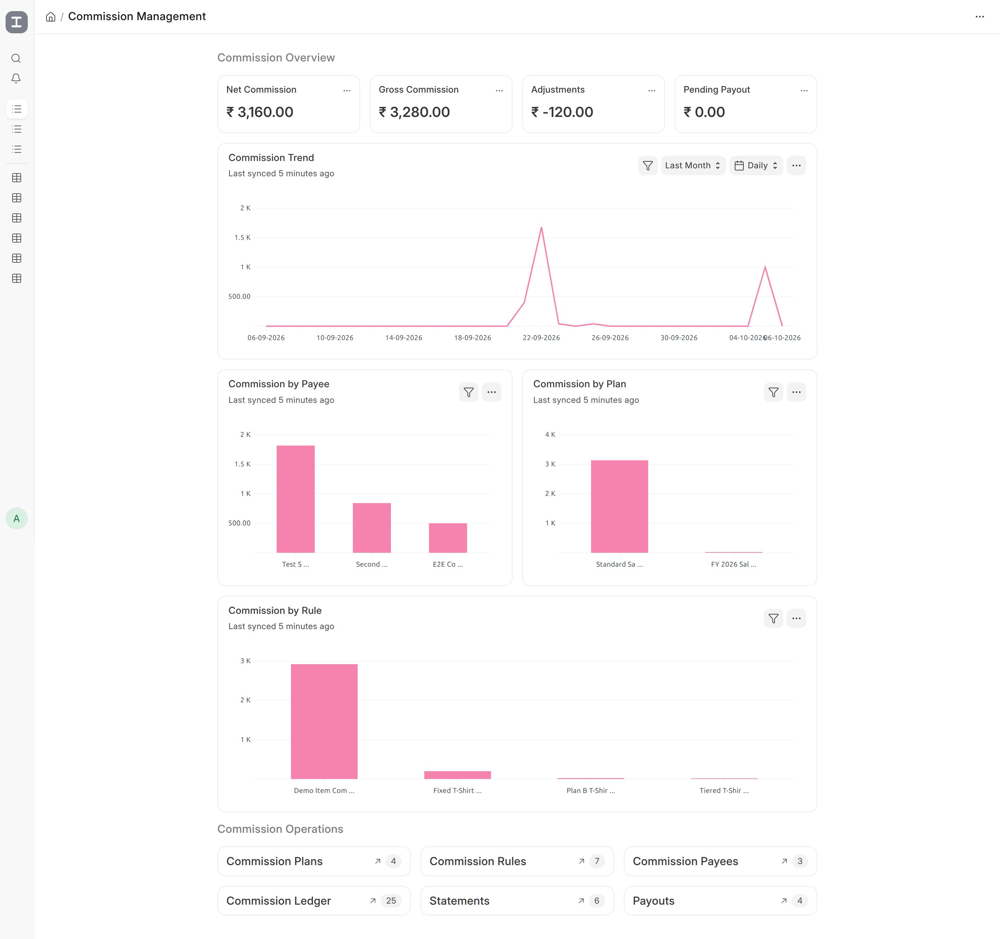
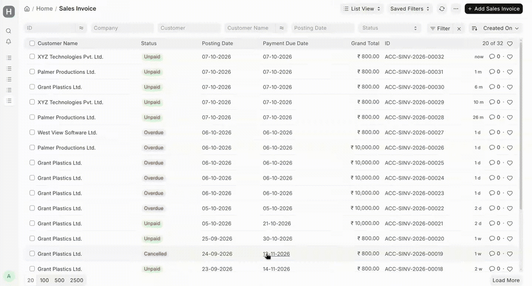
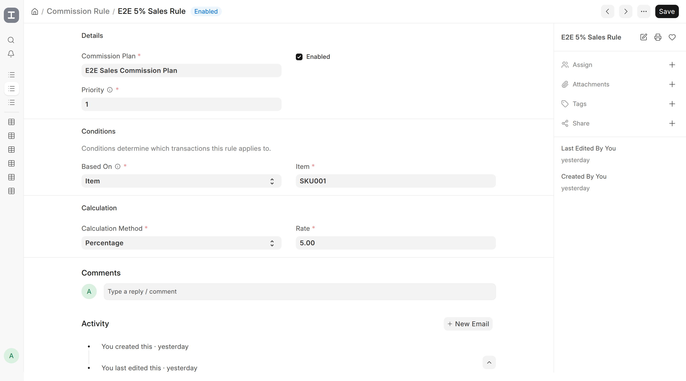
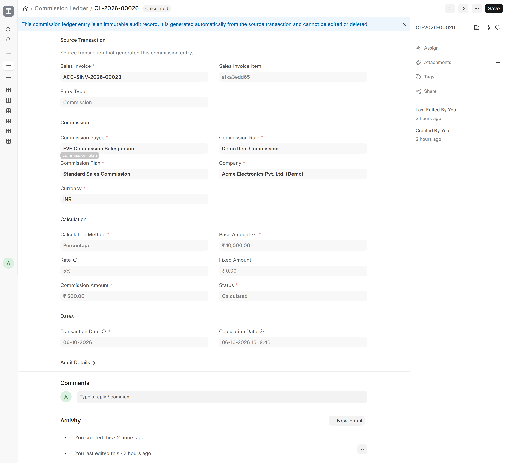

<p align="center">
  
</p>

# Incentive Compensation

Commission and incentive compensation engine for ERPNext.

Incentive Compensation adds a configurable commission engine to ERPNext, allowing businesses to define commission plans and rules, automatically calculate commissions from sales transactions, review and approve commission statements, and track payouts.

> **Status:** MVP
>
> **Target:** Frappe / ERPNext v16

## Features

- Commission Plans
- Commission Rules
- Percentage-based commissions
- Fixed-amount commissions
- Tiered commissions
- Commission Payees
- Automatic commission calculation from Sales Invoices
- Sales Team commission allocation
- Immutable Commission Ledger
- Commission Statements
- Statement review and approval workflow
- Commission Payouts
- Payout processing workflow
- Commission reversals when Sales Invoices are cancelled
- Idempotent commission generation
- Commission reports
- Role-based access control
- Audit-oriented historical commission records

## Screenshots

### Commission Management Workspace

The Commission Management Workspace provides a central view of commission performance, operations, and outstanding payouts.



### End-to-End Commission Workflow

From a submitted Sales Invoice to a paid commission payout:



### Commission Rule Configuration

Commission rules can be configured using transaction attributes, priorities, and different calculation methods.



### Commission Ledger

Commission Ledger entries provide an immutable audit record of calculated commissions.



## How It Works

The basic commission lifecycle is:

```text
Commission Plan
│
▼
Commission Rule
│
▼
Commission Payee
│
▼
Sales Invoice
│
▼
Commission Ledger
│
▼
Commission Statement
│
▼
Review
│
▼
Approval
│
▼
Posting
│
▼
Commission Payout
```

### 1. Commission Plan

A Commission Plan defines the period and company for which a set of commission rules applies.

Plans contain:

- Company
- Currency
- Validity period
- Status

When multiple active plans are applicable, the engine selects the applicable plan with the most recent Valid From date.

### 2. Commission Rule

A Commission Rule defines when and how commission should be calculated.

Rules can be based on:

- Item
- Item Group
- Sales Person
- Customer
- Customer Group
- Territory

Supported calculation methods:

- Percentage
- Fixed Amount
- Tiered

Rules also support priorities so that the intended matching rule can be selected when multiple rules apply.

### 3. Commission Payee

A Commission Payee represents the person or partner who receives the commission.

A payee can be linked to:

- ERPNext Sales Person
- ERPNext Sales Partner

This provides a consistent recipient abstraction for commission records and payouts.

### 4. Commission Calculation

When a Sales Invoice is submitted, the commission engine evaluates the invoice against the applicable commission plan and rules.

For Sales Invoices with Sales Team allocations, commission is calculated for each applicable Sales Team member according to their allocated percentage.

The resulting commission is recorded in the Commission Ledger.

### 5. Commission Ledger

The Commission Ledger is the historical record of calculated commissions.

Ledger entries capture the calculation snapshot, including:

- Source Sales Invoice
- Sales Invoice Item
- Commission Payee
- Commission Plan
- Commission Rule
- Calculation Method
- Base Amount
- Rate
- Fixed Amount
- Commission Amount
- Transaction Date
- Calculation Date
- Entry Type
- Source Key

Ledger records are treated as immutable audit records after creation.

This means later changes to commission plans or rules do not rewrite historical commission calculations.

### 6. Commission Statements

Commission Statements group eligible ledger entries for a payee and date range.

A statement contains:

- Gross Commission
- Adjustments
- Net Commission
- Statement ledger entries

Once generated, the statement represents a snapshot of the underlying commission records and follows a controlled workflow.

### 7. Commission Payouts

A Commission Payout records the payment of an approved and posted commission statement.

Payouts track:

- Commission Statement
- Commission Payee
- Company
- Currency
- Amount
- Payment Date
- Payment Reference
- Status

### Workflow

**Commission Statement**

```text
Generated
│
▼
Under Review
│
▼
Approved
│
▼
Posted
│
▼
Paid
```

Statements can also be cancelled from the appropriate workflow stages.

**Commission Payout**

```text
Pending
│
▼
Processing
│
├──────────► Failed
│ │
│ └──► Processing
│
▼
Paid
```

Payouts can also be cancelled from the appropriate workflow stages.

### Reversals

When a Sales Invoice with calculated commissions is cancelled, the application creates corresponding reversal ledger entries.

Reversals preserve the original commission history rather than modifying or deleting the original ledger entry.

### Reports

The application currently provides:

- Commission Summary
- Commission by Payee
- Commission by Plan
- Commission by Rule
- Commission by Invoice
- Commission by Date

These reports provide different views of commission activity for analysis and reconciliation.

### Roles

The application provides the following roles:

| Role                      | Purpose                                                 |
| ------------------------- | ------------------------------------------------------- |
| Commission User           | General access to commission records                    |
| Commission Manager        | Manage commission configuration and statement workflows |
| Commission Payout Manager | Manage commission payout processing                     |

## Installation

In an existing Frappe Bench:

```bash
cd $PATH_TO_YOUR_BENCH
```

Get the application:

```bash
bench get-app https://github.com/adeysh/incentive_compensation --branch version-16
```

Install it on a site:

```bash
bench --site <your-site> install-app incentive_compensation
```

For example:

```bash
bench --site acme-electronics.localhost install-app incentive_compensation
```

After installation, migrate the site:

```bash
bench --site <your-site> migrate
```

## Requirements

- Frappe Framework v16
- ERPNext v16
- Python 3.14+
- A working Frappe Bench environment

The application is currently developed and tested against Frappe / ERPNext v16.

## Development

Clone or get the application into your Bench:

```bash
bench get-app https://github.com/adeysh/incentive_compensation --branch version-16
```

Enable developer mode for the development site and install the application:

```bash
bench --site <your-site> install-app incentive_compensation
```

### Pre-commit

This project uses pre-commit for code formatting and linting.

Install it:

```bash
pip install pre-commit
```

Enable the repository hooks:

```bash
cd apps/incentive_compensation
pre-commit install
```

The repository is configured to use:

- Ruff
- ESLint
- Prettier
- pyupgrade

### Testing

Run the application tests with:

```bash
bench --site <your-site> run-tests --app incentive_compensation
```

The test suite covers areas including:

- Commission calculations
- Commission rule resolution
- Commission ledger behavior
- End-to-end commission workflows
- Statements
- Payouts
- Reports

## Architecture

The main commission engine is located under:

```text
incentive_compensation/
└── incentive_compensation/
    ├── commission_engine/
    │   ├── calculator.py
    │   ├── commission_events.py
    │   ├── engine.py
    │   ├── evaluator.py
    │   ├── ledger.py
    │   ├── payout.py
    │   ├── payout_workflow.py
    │   ├── permissions.py
    │   ├── resolver.py
    │   ├── statement.py
    │   ├── statement_resolver.py
    │   ├── statement_workflow.py
    │   └── transaction_builder.py
    │
    ├── doctype/
    │   ├── commission_plan/
    │   ├── commission_rule/
    │   ├── commission_tier/
    │   ├── commission_payee/
    │   ├── commission_ledger/
    │   ├── commission_statement/
    │   ├── commission_statement_entry/
    │   └── commission_payout/
    │
    └── report/
        ├── commission_summary/
        ├── commission_by_payee/
        ├── commission_by_plan/
        ├── commission_by_rule/
        ├── commission_by_invoice/
        └── commission_by_date/
```

The application separates:

- Configuration
- Rule resolution
- Calculation
- Transaction evaluation
- Ledger persistence
- Statement generation
- Statement workflow
- Payout processing
- Reporting

## Design Principles

- **Historical calculations are preserved:** Commission ledger entries represent a calculation snapshot. Changing a commission rule later should not change previously calculated commissions.
- **Calculations are idempotent:** The engine uses source keys to prevent the same source transaction from creating duplicate commission entries.
- **Reversals preserve history:** Cancelled transactions create reversal entries instead of modifying historical commission records.
- **Workflow controls financial state:** Statements and payouts move through explicit states rather than allowing arbitrary status changes.

## Current Scope

The current MVP focuses on the core commission lifecycle:

- Configure commission rules
- Calculate commissions
- Record commission history
- Generate statements
- Review and approve statements
- Post statements
- Create and process payouts
- Reverse commissions when source invoices are cancelled
- Analyze commissions through reports

## Roadmap

Potential future functionality includes:

- Sales targets and quotas
- More advanced commission splits
- Draws
- Bonuses
- Advanced clawback mechanisms
- Payroll integrations
- Payment integrations
- CRM integrations
- Forecasting
- Additional commission calculation strategies
- AI-assisted commission analysis

## Contributing

Contributions are welcome.

Before submitting a pull request:

1. Create a focused change.
2. Add or update tests where appropriate.
3. Run the relevant test suite.
4. Run the pre-commit checks.
5. Clearly describe the problem and solution in the pull request.

## License

This project is licensed under the MIT License.

See [license.txt](license.txt) for details.
